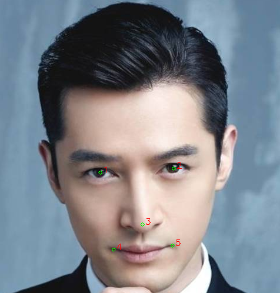

## SeetaFace2 Alignment

### Description
SeetaFace2 Alignment implements the approach of **a Fully End-to-End Cascaded CNN for Facial Landmark Detection**, which includes several sub-CNNs, which progressively refine the shape prediction via finer and finer modeling. The algorithm details can be found in our FG-2017 paper [FEC-CNN](#citation). The released SeetaFace2 Alignment is trained with 40,000 images and predicts 5 facial landmarks (as shown below). Please note that this implementation is a fast version of FEC-CNN, which is different from that described in the corresponding paper: smaller network structure for higher speed **(476 fps on 3.66GHz i7-6700, 143 fps on HUAWEI meta8 mobile with armeabi-v7a)**.

### Performance Evaluation
Using the same model of SeetaFace2 Alignment, experiments are conducted on [300-W](https://ibug.doc.ic.ac.uk/resources/300-W/) dataset, following the protocol published in [3]. The mean prediction errors normalized by the inter-ocular distance are shown in the following table. As shown, SeetaFace2 Alignment achieves better accuracy than comparative methods with very fast prediction speed.

***Protocal***
1. Training set: HELEN-trainset + LFPW-trainset + AFW
2. Testing set: HELEN-testset, LFPW-testset, Common set (HELEN-testset + LFPW-testset) and Challenging set (IBUG)

***Performance***

| Methods | HELEN | LFPW | Common set | Challenging set (IBUG) | Speed on CPU |
| :--------: | :-------------: | :------------: | :------------: | :------------: | :------------: |
| RCPR [1]  | 5.67 | 5.93 | 6.18 | 17.26 | - |
| SDM [2] | - | - | 5.57 | 15.40 | 30+ FPS (i5-2400)|
| CFAN **(SeetaFace1.0)** [3] | 5.44 | 5.53 | 5.50 | - | 40+ FPS (i7-3370)|
| LBF [4] | - | - | 4.95 | 11.98 | 320 FPS (i7-2600)|
| CFSS [5] | 4.87 | 4.63 | 4.73 | 9.98 | 25 FPS (i5-4590)|
| **SeetaFace2 Alignment** | **5.10** | **4.97** | **5.04** | **9.38** | **400 FPS (i7-4790)** |

> [1] Burgos-Artizzu, Xavier P and Perona, Pietro and Dollar, Piotr. Robust face landmark estimation under occlusion. ICCV 2013

> [2] Xiong, Xuehan and De la Torre, Fernando. Supervised descent method and its applications to face alignment. CVPR 2013

> [3] Zhang, Jie and Shan, Shiguang and Kan, Meina and Chen, Xilin. Coarse-to-fine auto-encoder networks (cfan) for real-time face alignment. ECCV 2014

> [4] Ren, Shaoqing and Cao, Xudong and Wei, Yichen and Sun, Jian. Face alignment at 3000 fps via regressing local binary features. CVPR 2014

> [5] Zhu, Shizhan and Li, Cheng and Change Loy, Chen and Tang, Xiaoou. Face alignment by coarse-to-fine shape searching. CVPR 2015

### How to run SeetaFace2 Alignment

To detect faces, one should first instantiate an object of `seeta::PointDetector2` and initialize it with path of the model file. Then one can call `Detect` to detect landmarks. See more details at under links.

### Notice

**SeetaFace2 Alignment only support 1 instance in single application.**

### Documents

* [Android](../example/android/README.md)
* [C++ on Windows/Linux](../example/C++/README.md)

### Downloads

* [Android/Windows/Linux](../attachment/README.md)

### Citation

If you find SeetaFace2 Alignment (FEC-CNN) useful in your research work, please consider citing:

    @inproceedings{he2017fully,
      title={A Fully End-to-End Cascaded CNN for Facial Landmark Detection},
      author={He, Zhenliang and Kan, Meina and Zhang, Jie and Chen, Xilin and Shan, Shiguang},
      booktitle={IEEE International Conference on Automatic Face and Gesture Recognition (FG)},
      year={2017},
      organization={IEEE}
    }

### License

SeetaFace2 Alignment is released under the [BSD 2-Clause license](../LICENSE).