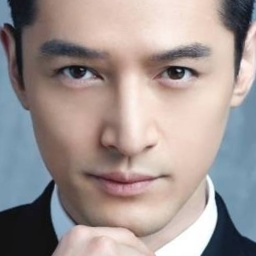

## SeetaFace2 Cropper

[](../LICENSE)

### Description
SeetaFace2 Cropper can crop face from original image according to 5 facial landmarks. 

<div align=center>

</div>

### How to run SeetaFace2 Cropper

An example for cropping face is shown below. The saved image `cropped_face.jpg` is already shown above.

```cpp
#include <opencv2/core/core.hpp>
#include <opencv2/highgui/highgui.hpp>

#include <seeta/FaceDetector2.h>
#include <seeta/PointDetector2.h>
#include <seeta/FaceCropper2.h>
#include <seeta/Struct_cv.h>

#define FD_MODEL "bindata/SeetaFaceDetector2.0.ats"
#define PD_MODEL "bindata/SeetaPointDetector2.0.pts5.ats"

int main()
{
	seeta::FaceDetector2 FD(FD_MODEL);
	seeta::PointDetector2 PD(PD_MODEL);
	seeta::FaceCropper2 FC;

	cv::Mat mat = cv::imread("1.jpg");
	seeta::cv::ImageData image = mat;

	auto face = FD.Detect(image);   // remeber to check if detection succeed
	auto points = PD.Detect(image, *face);
	seeta::cv::ImageData cropped_face = FC.Crop(image, points); // crop face according to 5 landmarks

	cv::Mat cropped_face_mat = cropped_face;
	cv::imwrite("cropped_face.jpg", cropped_face_mat);

	return 0;
}
```

### Documents

```cpp
/**
 * \brief crop face
 * \param image [in] color format
 * \param points [in] the detected landmarks of face
 * \return cropped face, size 256x256x3
 * \note the detected landmarks of must have number of PointDetector2::LandmarkNum
 * \note returning pointer was volatile, only accessable before next API called.
 * \note return empty image(0x0x0) if failed
*/
SeetaImageData
FaceCropper::Crop
(const SeetaImageData &image, const SeetaPointF *points)
const;
```

```cpp
/**
 * \brief crop face
 * \param image [in] color format
 * \param points [in] the detected landmarks of face
 * \param face [out] color cropped face, size 256x256x3
 * \note the detected landmarks of must have number of PointDetector2::LandmarkNum
 * \note return false if failed
 */
bool
FaceCropper::CropEx
(const SeetaImageData &image, const SeetaPointF *points, SeetaImageData &face)
const;
```

### Downloads

* [Download headers](../attachment/prebuild/header.zip). [View](../attachment/prebuild/include)
* [Download MSVC2013 libraries](../attachment/prebuild/lib/win/msvc2013.zip).
* [Download Ubuntu16.04 libraries](../attachment/prebuild/lib/linux/ubuntu16.04_facecropper.tar.gz).


### License

SeetaFace2 Cropper is released under the [BSD 2-Clause license](../LICENSE).