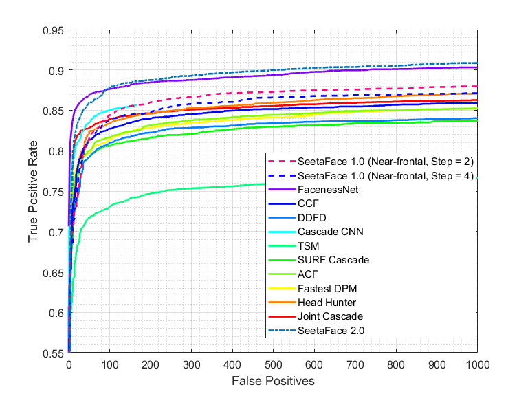

## SeetaFace2 Detection

### Description
SeetaFace2 Detection implements a CNN based Face Detector, which detects faces accurately and effciently and **achieves Real-Time performance on PC**. 

### Performance Evaluation
The discrete ROC curve on FDDB of the SeetaFace2 Detection is shown below:

Taking VGA input images(640x480) as example, SeetaFace2 Detector runs with 77FPS on i7-6700 CPU and 37FPS on HUAWEI meta8 mobile. As shown, SeetaFace2 Detection achieves promising accuracy with fast detection speed.

### How to run SeetaFace2 Detection (C++)

To detect faces, one should first instantiate an object of `seeta::FaceDetector2` and initialize it with path of the model file. Then one can call `Detect` to detect faces. See more details at the following links.

### Notice
**SeetaFace2 Detection only support 1 instance in single application.**

### Documents

* [Android](../example/android/README.md)
* [C++ on Windows/Linux](../example/C++/README.md)

### Downloads

* [Android/Windows/Linux](../attachment/README.md)

### License

SeetaFace2 Detection is released under the [BSD 2-Clause license](../LICENSE).